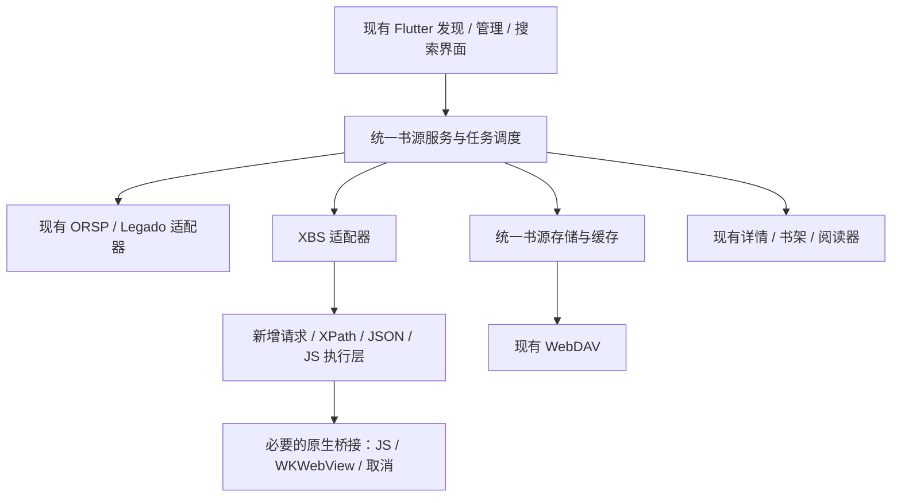

# 基于 Origo X 的香色书源集成计划

更新日期：2026-10-02。状态：已实现 XBS 核心运行链、独立找书、按书找源、分类筛选与分页及有界并发；[未签名 iOS 体验版已交付](https://github.com/fwx997/origo-x/releases/tag/xbs-preview-3-1)。完整兼容、真机和 LiveContainer 验证仍待完成。最新范围与证据见 [行为依据与验收](XIANGSE_BEHAVIOR_REFERENCE.zh-CN.md)。下文仍保留长期规划，不代表全部条目已完成。

已实现内容、验证证据和未完成项见 [实施记录](XIANGSE_PROGRESS.zh-CN.md)。以下为完整目标，不能将计划条目视为已完成。

## 1. 项目目标与范围

以官方仓库 https://github.com/miloquinn/origo-x 为唯一代码基底，在 `book/origo-x` 中实施。保持 Origo X 的 Flutter 导航、书架、阅读器、字体、主题、本地书籍和 WebDAV 框架，加入香色闺阁的书源运行能力，以及发现、书源管理、找书和换源逻辑。优先交付 iOS IPA，供现有安装方式和 LiveContainer 测试。

**用户最新确定：名称和图标均保留 Origo X 仓库原样，不使用嘟嘟品牌。** 旧 `book/dudu` 的 UI、Swift XBS 引擎、数据层、阅读器及品牌资产均不迁入。新模块在 Origo X 的架构下实现。

品牌不作替换；公开仓库中的名称不必与商店版完全一致，以当前官方源码配置为准。

用户已购买官方探元并反馈全量 JSON 导入仍不可用；这项反馈作为转向原生 XBS 支持的依据。截图确认权益已解锁，但不是每条源失败原因的诊断记录。

确定的产品要求：

- 直接导入原始 `.xbs` 和香色 JSON，完整保存 185 条小说源及其规则，不再以静态字段转换代替运行时兼容。
- 支持发现分类、榜单、源内找书、跨源搜索、书源管理，以及搜索结果到详情、目录、正文、书架的完整流程。
- 跨源搜索、源批量检测和发现聚合必须支持受控并发；结果逐批出现，可以停止、重试和切换查询。
- 保留本地字体导入、系统/已下载字体、现有阅读体验与 WebDAV；不依赖 Origo 账号、会员或官方云端服务。
- 本地书籍、书架和已缓存章节可离线使用；在线书源仍需要网络。
- 保留 Origo X 仓库名称、图标、开源许可及来源，补充修改说明；交付对应源码与构建方式。

第一版聚焦小说。原包中的漫画、视频、音频应在导入预览中单独计数，保留原文件备份，不纳入本轮阅读链验收。书评社区、其他云账号、像素级复刻香色界面和 Android 专用引擎不作为第一版目标。

## 2. 已确认的项目基础

| 部分 | 当前证据 | 集成策略 |
| --- | --- | --- |
| 主框架 | `origo-x` 基线 `f14f841`，Flutter，iOS 配置最低 15.0 | 保留导航、界面风格和阅读器；暂不无故提高系统要求 |
| 现有搜索 | `source_search_page.dart` 使用 `Future.wait`，整批结束后统一回填；有查询代次检查 | 提取搜索控制器，加入并发上限、增量结果及真正的取消 |
| 现有发现 | `book_sources_page.dart` 有推荐、分类、最新及多源筛选 | 接入香色 `bookWorld`，扩展源内筛选和榜单，不重建整套首页 |
| 现有字体 | `custom_font_service_io.dart` 已实现本地字体导入与注册 | 复用并回归测试 |
| 现有 WebDAV | 已同步书源、书籍、进度、书签等数据 | 在现有同步接口上增加 XBS 模型支持 |
| 旧嘟嘟工程 | `dudu` 基线 `3b567e9`，Swift | 仅保留存档，不迁入代码或品牌资产 |
| 旧 Dart 草稿 | `lib/book_sources/xbs/`、FJS 与 XPath 依赖尚未形成可构建的完整功能 | 作为备选材料，不能记为已实现；选定引擎后只保留一条主路线 |
| 旧 JSON 方案 | 185 条中 51 条有静态转换，134 条为实验映射 | 仅作对照和回归样本，不作为新引擎输入基线 |

旧项目的完成勾选不计入新版本进度。新 XBS 模块必须重新通过真实规则的语义测试、空结果判断、WebView 和 nativeTool 桥接验证。

## 3. 185 条源的需求基线

本次原文件为 `sourceModelList+3.xbs`，总计 225 条，其中小说 185 条。另一份 296 条 runtime 包的 185 条小说配置与它完全相同。功能清单见同目录 `xiangse-source-inventory.json`。

已检查到：

- 167 条有非空 `bookWorld`，发现页不能只处理搜索接口。
- 8 条有书单入口和书单详情请求；没有实际配置独立 `searchShudan` 请求的源，不应伪造该能力。
- 1 条提供联想词请求；其他源可使用本地搜索历史，不能因此判为不可用。
- 存在整页 `JSParser`、WebView、请求/响应编码及 `nativeTool` 使用。
- 发现的 `nativeTool` 方法包括 `getCache`、`setCache`、`log`、`XPathParserWithSource`、`md5Encode`、`deviceIdWithTemplateWithSeparator`、`readTxtFile`。

兼容状态和网站健康状态分开记录。能导入、能执行某类规则、某次能搜索、能完整阅读是四件不同的事。185 条必须完整保存；真实可读数量以逐源记录为准，不能预先承诺失效站点也能恢复。

## 4. 产品功能规格

### 4.1 书源导入与管理

1. 支持文件、粘贴 JSON、订阅 URL 三种入口；文件选择器和 iOS 文件打开支持 `.xbs` / `.json`。
2. 导入前展示总数、小说数、新增数、重复数、格式错误数。格式错误给出记录，正常条目继续导入。
3. 保留别名、名称、地址、权重、分组、启停状态、全部动作配置和未知字段。保留未经改写的原始备份。
4. 不以固定书名搜索、不以导入时联网验证筛掉条目；不套用现有 Legado 的“最多筛 120、保留 30”流程。
5. 支持名称/域名/分组本地筛选、多选启停、调整权重、分组、复制、编辑、导出和删除确认。
6. 重复导入更新同一源的配置时保留稳定 ID、用户排序、分组和启停设置；同域名不同规则可以并存。
7. 源编辑器提供基础信息、请求与解析字段、原始 JSON；保存前只做结构检查，调试单独执行。
8. 状态至少区分：未检测、可搜索、可阅读、无结果、超时、网络错误、需要站点验证、规则不支持、解析失败、用户禁用。失败不自动删除或永久禁用。
9. 批量检测分为搜索检测、完整阅读链检测；显示阶段、耗时和原因，支持停止及仅重试失败项。

### 4.2 发现与源内浏览

- 使用当前“发现/书源”入口承载：常用源与分组 → 单源 → 分类/榜单/筛选 → 书籍列表。
- 按原源 `bookWorld` 的分类顺序、请求配置、筛选项和分页语义加载，不把所有榜单强行当作搜索关键词。
- 支持下拉刷新、追加页、返回时保留位置和筛选、源内搜索、收藏常用分类。
- 多源推荐或分类聚合采用限量并发与增量展示；一个站点超时不清空其他结果。先加载当前可见/已选范围，避免每次进页面就请求全部 185 个源。
- 有书单能力的源展示“书单 → 详情 → 书籍”；无相应动作的源不显示无效入口。书评作为后续扩展，不阻塞首版找书流程。

### 4.3 全源搜索、源内搜索与换源

- 搜索范围：全部启用源、选定分组、多选源、单源。
- 默认提交关键词才请求网络；支持书名/作者匹配筛选、搜索历史和清空历史。源未提供独立作者接口时，使用普通搜索后筛选，界面说明其语义。
- 实时显示已完成/总源数、匹配数、失败数；返回结果立即展示，慢源继续搜索。
- 同一本书可以合并展示，但保留每个来源候选、最新章节、耗时和原地址。作者缺失或存在冲突时，不能仅凭同名强行合并。
- 排序参考精确匹配、作者匹配、源权重和响应速度；增量结果不能持续打乱用户正在点击的位置。
- 每个源独立维护分页和游标；“加载更多”只请求仍有下一页的源。
- 停止搜索、退出页面、切换范围、输入新词时，取消对应旧任务。已完成结果可保留，旧任务不得覆盖新结果。
- 详情、加入书架、阅读、缓存与换源接到现有阅读器。换源时按章节标题与顺序辅助匹配，无法可靠对齐时让用户选择，不静默跳章。

## 5. XBS 执行能力

必须实现的是运行时能力，而不是只替换 JSON 字段：

| 能力 | 具体要求 |
| --- | --- |
| 文件模型 | XXTEA 解码、原始 JSON、源级/动作级配置继承、别名与稳定身份 |
| 请求 | `requestInfo` 的字符串和 JS 返回值、GET/POST、参数、请求头、相对 URL、重定向、Cookie 与编码 |
| 上下文 | `config`、`params`、`result`，包括关键词、页码、offset、filter、responseUrl 和 queryInfo |
| 提取 | XPath、HTML/JSON、原源使用的 JSON 路径、正则、链式处理与回退；保留原来的求值顺序 |
| 脚本 | 字段 JS、请求 JS、整页 `JSParser`；返回值区分字符串、对象和列表 |
| nativeTool | 按实际 185 条源使用情况补齐上述缓存、日志、XPath、摘要等方法；未知调用明确报错 |
| 浏览器 | 为需要 DOM/脚本执行的源提供受控 WKWebView；单次 XHR 可等价用 HTTP 时允许优化，但必须验证返回一致 |
| 阅读链 | 搜索、详情、目录、正文；分页去重、防循环、段落保留、章节边界、源内过滤 |
| 发现链 | `bookWorld` 分类与筛选、书单、源提供的联想词；能力按真实配置声明 |

站点自身的登录/验证码与 Origo 平台账号是两件事。产品不要求 Origo 账号；若某源需要用户自己的站点会话，应显示站点验证入口，成功后可重试。不能把验证页、登录页或广告页判为正文。

`readTxtFile` 仅访问该源导入的辅助文件，不开放任意文件读取。设备标识方法使用应用内按源隔离的持久随机标识；若个别源要求外部特定标识，作为单源兼容问题报告。日志隐藏请求凭据和正文。

## 6. 技术架构与复用路线

首选方向：在 Origo X 中新增协议适配器，复用其现有请求策略、数据模型、缓存、正文处理和阅读入口；新增 XBS 文件解码、配置继承、规则求值与动作运行时。业务与调度优先保持在 Dart 层，仅为受控脚本执行和 WKWebView 等平台能力增加精简原生桥接，不引入旧 dudu 的核心代码或依赖。

JS 与 XPath 引擎选型是阶段 0 的决策点：优先验证当前 Origo 工作区的 Dart/FJS 与 XPath 草稿所用依赖，确认完整 XPath 语义、同步 nativeTool 桥接、执行限时和取消能力。普通 `Future.timeout` / `Task.cancel` 不等于终止死循环；不满足要求就替换对应底层依赖。草稿不是成品，不同时维护两套生产执行链。

跨原生桥接按执行任务合批，不逐个字段频繁跨语言调用。命令携带任务 ID、查询代次、源 ID/修订号、动作和参数；事件携带进度、结果、错误；取消按任务 ID 传播到请求、解析和浏览器。解析器、原生文档句柄和 JS 对象不能跨线程共享。

数据层只保留一份业务真相：扩展 `RegisteredBookSource` 和 `BookSourceRegistry` 支持 XBS。原始规则保留在本地规则存储，使用稳定源 ID 与配置修订号分离的方式；配置更新使相关缓存失效，但不改变书架关联。规则体积和写入耗时经测试后决定落 SQLite 或原子文件，避免每次更新测试状态都重写整个规则包。

主要接入位置：

| 模块 | 位置/变更 |
| --- | --- |
| 协议与身份 | `lib/book_sources/models/registered_book_source.dart`：增加 XBS、序列化、兼容旧数据 |
| 导入 | `book_source_import_analyzer.dart`：识别 XBS/香色 JSON，与 ORSP、Legado 分开路由 |
| 存储 | `book_source_registry.dart`：保留未检测及不支持的 XBS，提供分组、状态、批量操作 |
| 统一调用 | `book_source_client.dart`：XBS 适配器、发现能力、取消令牌 |
| 并发 | 新增共享任务调度器及搜索控制器，替代页面级无上限 `Future.wait` |
| 页面 | `book_sources_page.dart`、`source_search_page.dart`、`book_source_management_page.dart` |
| iOS | 必要的 JS/WKWebView 桥接及文件类型关联，平台模块不持有书架或阅读进度 |
| 同步 | `metadata_sync_adapters.dart`：XBS 完整配置、身份、删除与冲突处理 |

保留当前未提交草稿；选定路线后再精确整理其依赖，不能覆盖其他本地改动。旧 dudu 工程仅保留为存档。Origo X 的显示名、启动图标和应用内品牌维持官方仓库原样。

## 7. 并发与资源策略

“多线程”落实为网络并发、后台解析、JS 上下文隔离及增量 UI，而不是同时创建 185 个 WebView 或线程。

以下为首轮默认值，最终以真机数据调整：

| 任务/资源 | 默认上限 | 说明 |
| --- | --- | --- |
| 全应用书源网络任务 | 12 | 搜索、检测、发现、缓存共用总预算 |
| 同一站点 | 2 | 同站点别名共享限额；逻辑源配置和会话仍隔离 |
| 跨源搜索 | 12 | 可调 4～16，仍受全局预算限制 |
| 批量检测 | 8 | 低于当前阅读和用户搜索的优先级 |
| 发现聚合 | 4 | 按可见/选定范围逐批加载 |
| 章节预取/缓存 | 4 | 不抢占正在打开章节的请求 |
| CPU/JS 工作执行单元 | 初始 2 | 按设备能力调整；解析和脚本不阻塞 UI |
| WKWebView | 1，最多 2 | 独立小池，使用后回收；仍计入全局资源预算 |

调度要求：

- 前台正在打开的章节优先，留出前台容量；后台批量检测不可饿死阅读请求。
- 不同源和不同查询隔离临时缓存、页游标、Cookie 与 JS 上下文。依赖前一步状态的同源动作有序执行，互不依赖的源并行。
- 排队等待、连接超时、响应超时、JS 执行预算和 WebView 超时分开记录；超时释放工作槽位，不能留下无限循环占住线程。
- 普通请求初始总超时 15～20 秒，JS 初始执行预算 2 秒，WebView 初始 25 秒；长正文/下载使用独立配置。
- 用户主动取消不自动重试；暂时性网络错误最多自动重试 1 次，429 遵循服务端退避。缺规则、登录页、解析失败不反复重试。
- 事件按 50～100 毫秒合批回填 UI；结果去重和排序在工作层处理，保留滚动位置。
- iOS 进入后台时遵守系统限制，保存已完成结果并取消/挂起非必要批量任务；不承诺杀后台后继续搜索。

## 8. WebDAV 与数据迁移

- 沿用现有 WebDAV 配置、书架、进度和书签同步。
- 增加 XBS 原始配置、稳定源 ID、分组、权重、用户启停状态和配置修订号的同步。
- 检测耗时、临时故障、请求任务和运行中状态保持设备本地，不把一次超时同步为另一台设备的永久禁用。
- Cookie、会话令牌、WebView 数据不默认随书源上传；规则中的凭据应与配置分离并保存在设备安全存储，显式的私人导出另行处理。
- 同一源的配置冲突、删除标记、旧客户端不识别的 XBS 数据均需保留和可恢复，不能因为解析失败推送删除。
- 升级前备份；不直接读取或修改 App Store 应用的沙盒。已有资料通过用户导出/导入或 WebDAV 迁移。

## 9. 实施顺序与阶段产物

| 阶段 | 工作 | 可验收产物 |
| --- | --- | --- |
| P0 基线与执行验证 | 固定官方 Origo X 源码及品牌，建立源功能清单；验证 XPath、JS 终止、nativeTool、WKWebView 桥接及基线构建 | 引擎路线决定、最小可运行样例、基线 CI 结果；未通过的能力不标为已支持 |
| P1 原始导入与阅读闭环 | 原样存储 185 条、XBS 协议路由、搜索/详情/目录/正文、基础脚本及编码、加入现有书架和阅读器 | 第一份可安装体验 IPA；直接导入原 XBS，选择已通过样例的源完成阅读 |
| P2 并发搜索与管理 | 共享调度、增量搜索、分页、真正取消、来源合并、换源、分组编辑、批量检测 | 185 源队列测试报告；无整批等待、无陈旧结果覆盖、失败项可解释 |
| P3 香色发现与复杂规则 | 分类/榜单/筛选/书单、整页 JSParser、完整 nativeTool 使用清单、浏览器请求、站点验证 | 发现→分类→书籍→阅读闭环；复杂源逐类样例与能力覆盖报告 |
| P4 WebDAV 与真机收敛 | 配置同步、迁移恢复、弱网/后台/低内存、字体与阅读回归、LiveContainer 安装 | 可安装 IPA、对应源码、逐源结果报告、已知限制和回退步骤 |

阶段验收不是把目标永久缩成少量源。P1 先交付完整流程，后续按规则能力补齐覆盖；每一阶段保留全部 185 条源，支持随时重新检测。

## 10. 验收标准

### 数据和规则

- 原包 185 条小说全部进入管理页；未检测、不支持、超时的源均可见。原始配置可导出并核对字段完整性。
- 同域不同别名不丢失；重复导入不重复增殖，也不重置用户分组和书架关联。
- 使用可重复的离线页面样例覆盖中文编码、GET/POST、XPath/JSON、JSParser、动态请求、缓存上下文、目录/正文分页、分类筛选、相对链接和章节边界。
- 联网记录搜索与详情书名对应、目录数量、首章及后续章节抽样、正文有效性；错误页和空搜索不算通过。
- 185 条输出逐源状态、失败阶段和原因；按规则不支持、站点失败、验证需求分别统计，不以勾选或 HTTP 200 宣称全可用。

### 并发与交互

- 用 185 个可控模拟源测试队列：观测到的活动任务不超过配置预算，同站点不超过 2。
- 放入一个 20 秒慢源时，其他正常源结果仍逐批出现；一个任务异常不终止整批。
- 连续切换关键词 A/B/C，页面最终只包含 C 的结果和分页状态。
- 停止/离页后不再启动排队任务；在运行请求和脚本可被终止。取消反馈目标小于 1 秒，实际释放耗时单独测量，不用 UI 隐藏掩盖后台任务。
- 相同作品的多来源保留可换源；不同作者同名作品不错误合并；各源加载更多不漏页、不重复。
- 低内存设备下 WebView/JS 池受限，搜索期间滚动、返回、开书不长时间阻塞。

### 保留能力与交付

- TXT/EPUB 导入、本地字体、字号/行距/主题、阅读位置、章节缓存、现有书架操作通过回归。
- WebDAV 在两次独立安装/设备之间验证书源、书架、进度同步及删除/冲突恢复；不上传默认排除的会话数据。
- macOS CI 构建 iOS，执行对应 Swift/Flutter 测试；IPA 包含独立应用身份，提供源码版本及校验值。
- LiveContainer 和实际手机验证单独记录。编译成功、模拟器通过不能冒充手机验证通过。

## 11. 工作量判断

复用 Origo X 会明显减少书架、字体、阅读渲染、主题和同步界面的工作。XBS 兼容层按新架构实现，旧 dudu 的代码和品牌均不迁入，因此仍是一次中等规模的引擎与业务集成，不是加三张页面或删一个会员判断。

主要不确定性集中在 JS/nativeTool 的真实语义、浏览器请求、可终止的并发执行、不同源的分页与状态隔离。先完成 P0 能力验证和 P1 阅读闭环，再依据样例通过率估算剩余工作量；当前不承诺未经验证的完成日期或 185/185 在线可用。

本计划取代旧 `dudu/docs/REPLICA_PLAN.md` 中“整套界面一比一复刻”的方向。在 Origo X 基底上新增所需的发现、管理、找书和书源执行能力，保持原仓库名称和图标。
